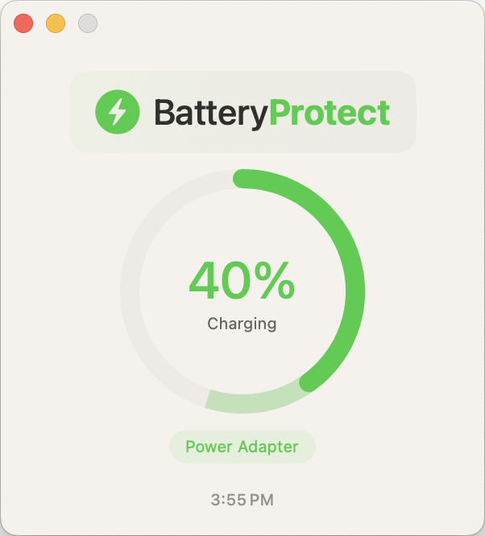

# 🔋 BatteryProtect

A lightweight macOS menu bar app that helps protect your MacBook's battery health by monitoring battery levels and providing timely notifications.


## ✨ Features

### 🔔 Smart Battery Alerts
- **Low Battery Alert**: Notifies when battery drops below 20%
- **High Battery Alert**: Warns when battery is above 80% and plugged in (to preserve battery health)
- **Real-time Monitoring**: Checks battery status every 2 seconds
- **System Notifications**: Shows alerts even when app is in background

### 🖥️ Native macOS Integration
- **Menu Bar Icon**: Quick access via status bar (🔋)
- **Native Battery Info**: Displays exact same power source and charging status as macOS
- **Background Operation**: Runs continuously without requiring the app window to be open
- **Clean UI**: Modern SwiftUI interface with real-time updates

### 📊 Accurate Battery Information
- **Power Source**: Shows "Power Adapter", "Battery", etc. (matches native macOS)
- **Charging Status**: Displays "Charging", "Not Charging", "Charged", "Discharging"
- **Battery Level**: Real-time percentage with 1-second updates
- **Last Update Time**: Shows when information was last refreshed

## 🚀 Installation

### Prerequisites
- macOS 13.0 (Ventura) or later
- Xcode 15.0 or later
- Swift 5.9+

### Building from Source

1. **Clone the repository**
   ```bash
   git clone https://github.com/iamshiva003/BatteryProtect.git
   cd BatteryProtect
   ```

2. **Open in Xcode**
   - Double click `BatteryProtect.xcodeproj`, or
   ```bash
   open BatteryProtect.xcodeproj
   ```

3. **Build and Run**
   - Select "BatteryProtect" scheme and your Mac as the target
   - Press `Cmd + R` or click the Run button
   - Look for the battery icon (🔋) in your menu bar

### First Run
- The app will request permission to show notifications
- A battery icon (🔋) will appear in your menu bar
- Right-click the menu bar icon for options

## 📱 Usage

### Main Window
- **Battery Level**: Shows current battery percentage
- **Power Source**: Displays power source (Power Adapter/Battery)
- **Status**: Shows charging status (Charging/Not Charging/Charged)
- **Last Update**: Timestamp of last battery check

### Menu Bar Access
- **Right-click** the 🔋 icon in menu bar
- **Show Window**: Opens the main app window
- **Quit**: Closes the application

### Background Operation
- The app runs continuously in the background
- System notifications appear for battery alerts
- No need to keep the window open

## 🔧 Configuration

### Alert Thresholds
The app uses these default thresholds:
- **Low Battery**: ≤20% (alerts every 30 seconds)
- **High Battery**: ≥80% when plugged in (alerts every 30 seconds)

### Update Intervals
- **UI Updates**: Every 1 second
- **Background Monitoring**: Every 2 seconds
- **Alert Cooldown**: 30 seconds between alerts

## 🛠️ Technical Details

### Architecture
- **SwiftUI**: Modern declarative UI framework
- **IOKit**: System-level battery monitoring
- **AppKit**: Menu bar integration and notifications
- **Background Processing**: Continuous monitoring without UI

### Key Components
- `ContentView.swift`: Main UI interface with battery status display
- `BatteryProtectApp.swift`: App entry point and window configuration
- `BatteryMonitor.swift`: Battery monitoring and notification logic
- `MenuBarController.swift`: Menu bar icon and menu management

### Permissions
- **Notification Access**: Required for system alerts
- **Battery Monitoring**: Uses IOKit framework (no additional permissions needed)

## 📸 Screenshots

### Main Interface
```

```

### Menu Bar
```
Menu Bar: [🔋] ← BatteryProtect icon
Right-click menu:
├── Show Window
└── Quit
```

## 🚨 Alerts

### Low Battery Alert
```
⚠️ Low Battery
Battery level is low: 18%
```

### High Battery Alert
```
🔌 High Battery
Battery level is high: 85% - Consider unplugging to preserve battery health
```

## 🔍 Troubleshooting

### Common Issues

**App not showing in menu bar**
- Check if the app is running in the background
- Look for the 🔋 icon in the menu bar
- Try restarting the app

**No notifications appearing**
- Check System Preferences > Notifications & Focus
- Ensure BatteryProtect has notification permissions
- Verify Do Not Disturb is not enabled

**Battery info not updating**
- The app updates every 1-2 seconds
- Check the "Last Update" timestamp
- Restart the app if needed

### Debug Information
The app logs battery information to the console:
```
🔋 Battery: 97%, Power: AC Power, Status: Not Charging
🔔 Alert triggered: 🔌 Battery level is high: 97% - Consider unplugging to preserve battery health
```

## 🤝 Contributing

1. Fork the repository
2. Create a feature branch (`git checkout -b feature/AmazingFeature`)
3. Commit your changes (`git commit -m 'Add some AmazingFeature'`)
4. Push to the branch (`git push origin feature/AmazingFeature`)
5. Open a Pull Request

### Development Setup
```bash
# Clone and setup
git clone https://github.com/iamshiva003/BatteryProtect.git
cd BatteryProtect

# Open in Xcode and build
open BatteryProtect.xcodeproj
```

## 📄 License

This project is licensed under the MIT License - see the [LICENSE](LICENSE) file for details.

## 🙏 Acknowledgments

- **Apple**: For IOKit framework and macOS APIs
- **SwiftUI**: For modern UI development
- **macOS Community**: For battery health best practices

## 📞 Support

- **Issues**: [GitHub Issues](https://github.com/iamshiva003/BatteryProtect/issues)
- **Discussions**: [GitHub Discussions](https://github.com/iamshiva003/BatteryProtect/discussions)

---

**Made with ❤️ by Shivakumar Patil**

⭐ **If you find this app useful, please star the repository!** 